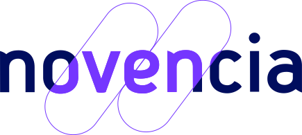

# Welcome to C++ FRUG!

<!-- _footer: "" -->

---

# Numéro 53 !

---

## Je suis votre hôte

Pour la 2ème fois

---

## Je suis votre hôte

Vivien MILLE

- Consultant chez Novencia
- C++ & Azure
- CPPP

---

# Le programme

---

## Programme

- 19h00 Accueil
- 19h15 Nouvelles du monde du C++
- 19h30 Calcul de la racine carrée inverse dans Quake III
- 20h Lightning talks
- 20h45 Conversations libres et buffet

---

# La vie du C++ FrUG

---

## C++FrUG

Vous pouvez y participer

---

## C++FrUG

En proposant un talk !

On peut vous aider

---

## C++FrUG

En rejoignant les servers Discord

C++Frug: https://discord.gg/YmKMABu9

Meetup: https://discord.gg/3K69BvqK

---

# L'actualité du C++ et de sa communauté

---
## CMake & Modules

* Version officielle: 3.28 avec Ninja pour gérer les modules (MSVC 14.34, LLVM/Clang 16.0, GCC 14)
* Une proposition de présentation ?

---
## Vidéos

* Premières vidéos de MeetingC++ 2023
* Premières vidéos de CppCon 2023

---
## Conférences 2024

- FOSDEM: 3-4 février, Bruxelles, BE
- CppOnSea online: 7-9 février
- EuroLLVM: 9-11 avril, Vienne, AU
- ACCU: 17-20 avril, Bristol, UK
- C++Now: 7-12 mai, Aspen, US
- CppOnSea: 2-5 juillet, Folkstone, UK
- CppCon: 15-20 septembre, Aurora, US

---

## Sponsor

Thank you !

---

# Apprenons et partageons notre connaissance du langage C++!
