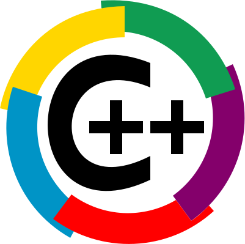
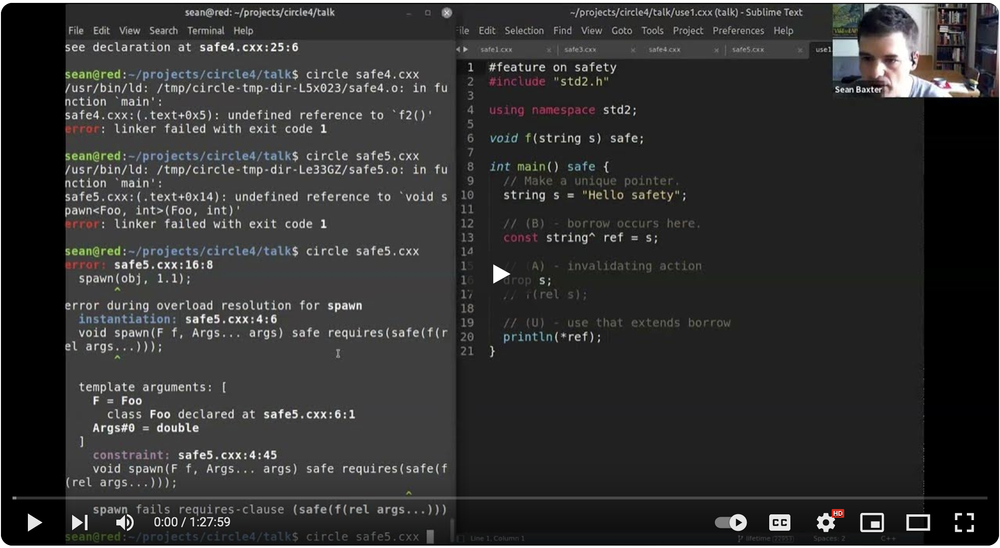
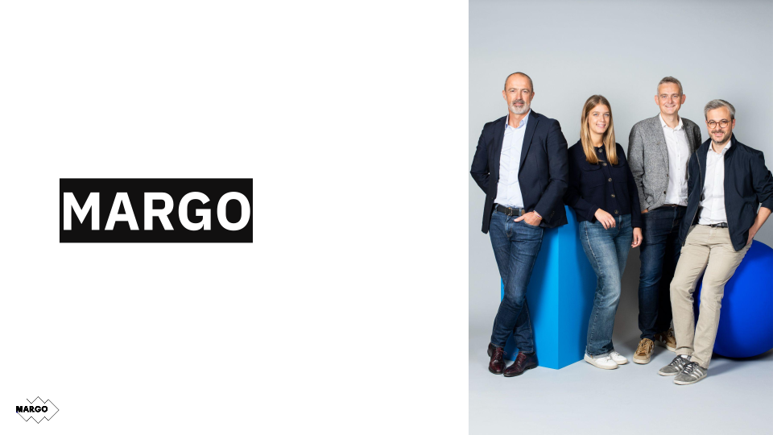
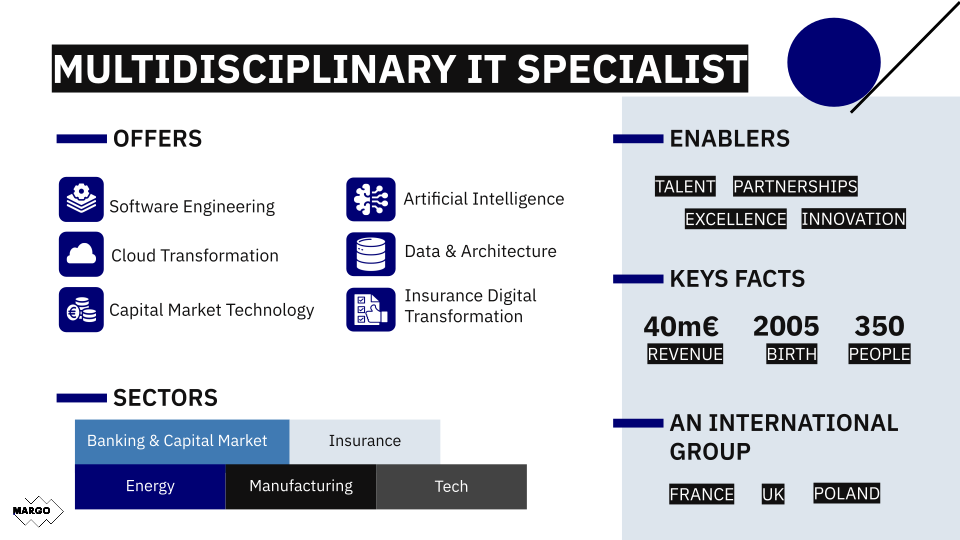

# Welcome to C++ FRUG!

<!-- _footer: "" -->

---

# #56 !

---
## I am you host

For the 5th time

---
## I am you host

Vivien MILLE

- Developer at BNPP CIB

---
# Schedule

---
## Schedule

- 19h00 Welcome
- 19h15 News of the C++ ecosystem / presentation of our sponsor
- 19h20 Fundamentals of Concurrency - Threads, Pools, and Patterns - Mike Shah
- 20h30 Lightning talks
- 20h45 Free speeches and pizzas

---
# C++FrUG

---
## C++FrUG

You can participate !

---
## C++FrUG

Propose a talk !

We can help to build your presentation

---

## C++FrUG

Host a C++ meetup !

You can:
- host the event (in your company, in a rented room)
- sponsor pizzas & drinks

---
## C++FrUG

Join the Discord servers

[C++Frug](https://discord.gg/YmKMABu9)

[Meetup](https://discord.gg/3K69BvqK)

---
# News from the C++ ecosystem and community

---
## ISO

* [April mailing](https://www.open-std.org/jtc1/sc22/wg21/docs/papers/2024/#mailing2024-04)
* Next meeting: 24-29 of June 2024, Saint Louis, Montana, US

---
## Standard

* Modules : Finally some workingish implementation of std modules (only in MSVC >17.10)
* Contracts: First as TS ?

---
## Safety ?

Lots of discussion, papers, news, blogs, opinions...

Is it even possible ?

[It Seems](https://www.youtube.com/watch?v=5Q1awoAwBgQ)

---
## Conferences 2024

- CppOnSea: 2-5 July, Folkstone, UK
- CppNorth: 21-24 July, Toronto, CA
- CppCon: 15-20 September, Aurora, US
- C++ Under the Sea: 11th October, Breda, NE
- MeetingC++: 14-16th November, Berlin, DE
---
## Sponsor

Thank you !

---

---

---
# Learn and share our knowledges of the C++ !
