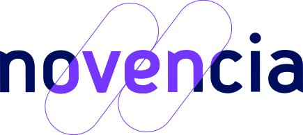

# Welcome to C++ FRUG!

<!-- _footer: "" -->

---

# Numéro 57 !

---

## Je suis votre hôte

Pour la 6ème fois

---

## Je suis votre hôte

Vivien MILLE

- Développeur chez BNPP CIB

---

# Le programme

---

## Programme

- 19h00 Accueil
- 19h15 Nouvelles du monde du C++
- 19h20 CPPMETA - Jean-Baptiste Vallon Hoarau
- 20h30 Lightning talks
- 20h45 Conversations libres et buffet

---

# La vie du C++ FrUG

---
## C++FrUG

Vous pouvez participer !

---
## C++FrUG

En proposant un talk !

On peut vous aider

---

## C++FrUG

Héberger un meetup C++ !

Vous pouvez:
- héberger l'événement (dans votre société ou une salle louée)
- sponsoriser les pizzas et boissons

---
## C++FrUG

En rejoignant les servers Discord

[C++Frug](https://discord.gg/YmKMABu9)

[Meetup](https://discord.gg/3K69BvqK)

---

# L'actualité du C++ et de sa communauté

---
## ISO

* Meeting ISO à St.Louis semaine prochaine
* [pre-St.Louis mailing](https://www.open-std.org/jtc1/sc22/wg21/docs/papers/2024/#mailing2024-05)

---
## Contracts, contracts, contracts everywhere

Au moins 24 papiers !
* dont certains en "contradiction" (Ship as TS vs Do not ship as TS)
* sujets complexes (safety, UB) et "politiques"

---
## std::optional<T&>

* Finally, some concensus !
* Equivalent to std::optional<std::reference_wrapper<T>> 
* Rebind !

---
## C++ Quiz

* Connaissez vous [C++Quiz](https://cppquiz.org) ?
* Maintenant en livre !
* [C++ Brain Teasers](https://pragprog.com/titles/akbrain/c-brain-teasers/)

---
## Tiobe

* C++ est deuxième !
* Devant C
* [Classement](https://www.tiobe.com/tiobe-index/)

---
## Conférences 2024

- CppOnSea: 2-5 juillet, Folkstone, UK
- CppNorth: 21-24 juillet, Toronto, CA
- CppIndiaCon: 23-24 août, online
- CppCon: 15-20 septembre, Aurora, US
- C++ Under the Sea: 11 octobre, Breda, NE
- NDC Techdown: 9-12 septembre, Kongsberg, NO
- MeetingC++: 14-16 novembre, Berlin, DE
- Core C++: 26-28 novembre, Tel-Aviv, IS

---

## Sponsor

Thank you !

---

# Apprenons et partageons notre connaissance du langage C++!
