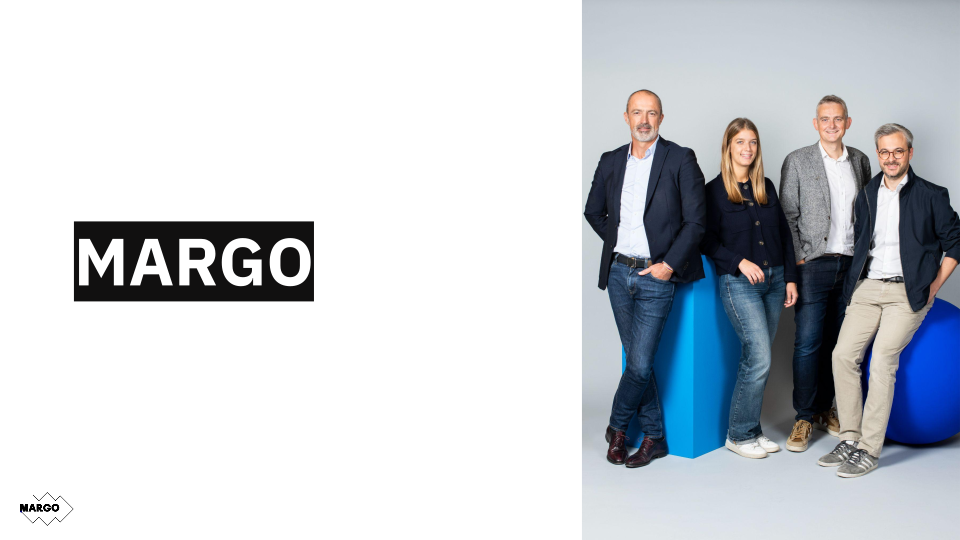

# Welcome to C++ FRUG!

<!-- _footer: "" -->

---

# #56 !

---
## I am you host

For the 7th time

---
## I am you host

Vivien MILLE

- Developer at BNPP CIB

---
# Schedule

---
## Schedule

- 19h00 Welcome
- 19h15 News of the C++ ecosystem
- 19h20 Heaps Don't Lie - Guidelines for Memory Allocation in C++ -- Mathieu Ropert
- 20h20 Snacks & drinks
- 21h20 The CUDA C++ Developer's Toolbox -- Bryce Adelstein Lelbach

---
# C++FrUG

---
## C++FrUG

You can participate !

---
## C++FrUG

Propose a talk !

We can help to build your presentation

---

## C++FrUG

Host a C++ meetup !

You can:
- host the event (in your company, in a rented room)
- sponsor pizzas & drinks

---
## C++FrUG

Join the Discord servers

[C++Frug](https://discord.gg/YmKMABu9)

[Meetup](https://discord.gg/3K69BvqK)

---
# News from the C++ ecosystem and community

---
## ISO

---
## Compilers

Clang 20:
- [P2718R0](https://wg21.link/P2718R0) Lifetime extension in range-based for loops
- [P2641R4](https://wg21.link/P2893) Checking if a union alternative is active

gcc 15: still in progress, probably April

---
## 

---
## Conferences 2025

- ACCU: 1-4 April, Bristol, UK
- CppNow: 28 April-2 May, Aspen, US
- CppOnSea: 23-25 June, Folkstone, UK
- CppNorth: 20-23 July, Toronto, CA
- CppCon: 13-19 September, Aurora, US
- MeetingC++: 6-8 November, Berlin, DE

---
## Sponsor

Thank you !

---

---

---
# Learn and share our knowledges of the C++ !
