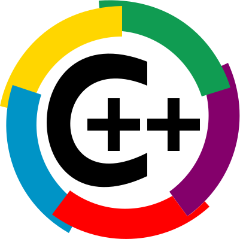
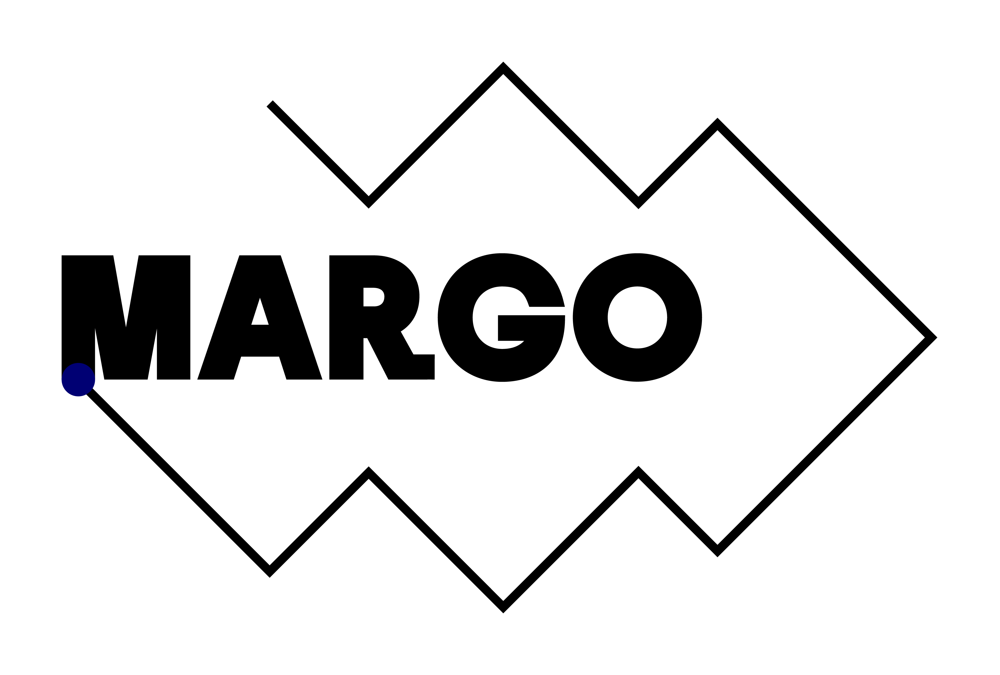

# Welcome to C++ FRUG!

<!-- _footer: "" -->

---

# #58 !

---
## I am you host

For the 8th time
- Vivien MILLE
- Developer & Code cleaner at BNPP CIB

---
# Schedule

---
## Schedule

- 19h00 Welcome
- 19h15 News of the C++ ecosystem
- 19h20 Lightning talks
- 19h50 Snacks & drinks
- 20h30 C++ Coroutines - Gods from the Machine -- Phil Nash

---
# C++FrUG

---
## C++FrUG

You can participate !

---
## C++FrUG

You need to participate !

---
## C++FrUG

Propose a talk !

We can help to build your presentation and adapt the agenda

Remainder:
* Lightning talk
* Short talk (15-30 minutes)
* Full-fledged talk (50-60 minutes)

---

## C++FrUG

Host a C++ meetup !

You can:
* host the event (in your company, in a rented room)
* sponsor snacks & drinks

---
## C++FrUG

Join the Discord servers

[C++FrUG](https://discord.gg/YmKMABu9)

[Meetup](https://discord.gg/3K69BvqK)

---
## C++FrUG

You can [join](https://www.helloasso.com/associations/c-frug) the association !

---
# News from the C++ ecosystem and community

---
## Compilers

gcc 15:
- P2662R3, Pack indexing
- P2893R3, Variadic friends
- ...

---
## Conferences 2025

- CppNow: 28 April-2 May, Aspen, US
- CppOnSea: 23-25 June, Folkstone, UK
- CppNorth: 20-23 July, Toronto, CA
- CppCon: 13-19 September, Aurora, US
- MeetingC++: 6-8 November, Berlin, DE

---
## Sponsor

Thank you !

---
# Learn and share our knowledge of the C++ !
