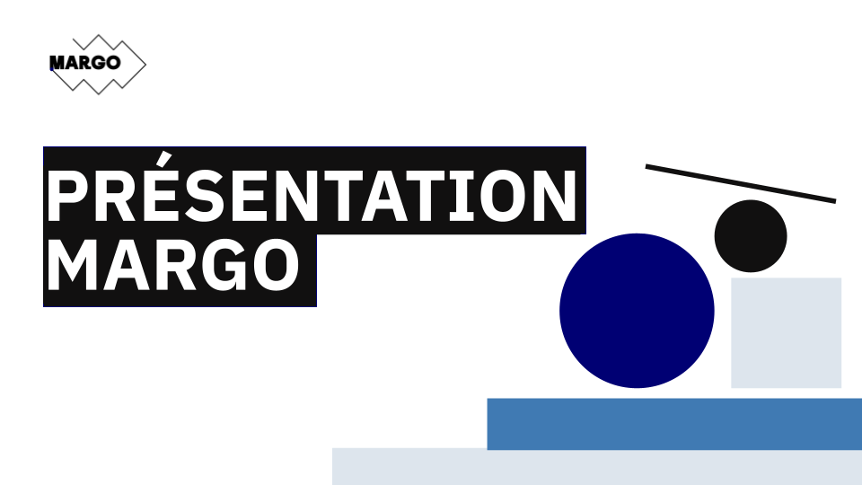
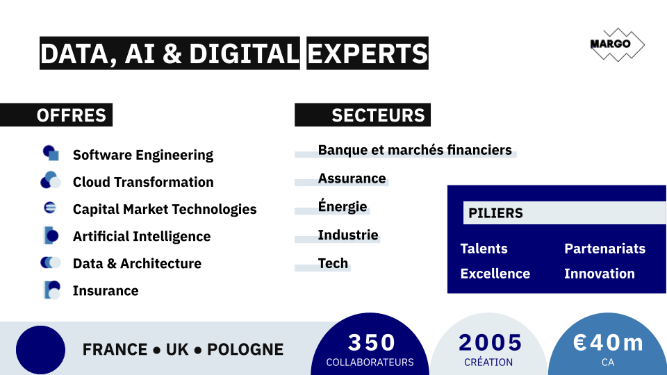
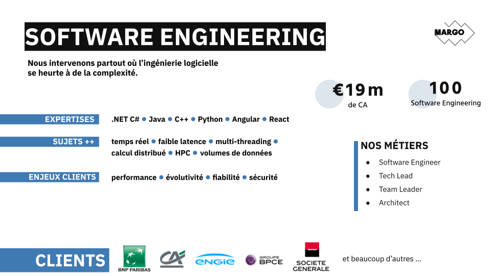

# Welcome to C++ FRUG!

<!-- _footer: "" -->

---

# #62!

---
## I am you host

For the 11th time
- Vivien MILLE
- Developer & Code cleaner at BNPP CIB

---
# Schedule

---
## Schedule

- 19h00 Welcome
- 19h15 Introduction
- 19h20 Lightning talks
- 19h50 Snacks & drinks
- 20h40 Shorts talks:
  - Drogon
  - Branch prediction
  - inplace_vector
  - Annotations in C++26

---
# C++FrUG

---
## C++FrUG

You can participate !

---
## C++FrUG

You need to participate !

---
## C++FrUG

Propose a talk !

We can help to build your presentation and adapt the agenda

Remainder:
* Lightning talk
* Short talk (15-30 minutes)
* Full-fledged talk (50-60 minutes)

---

## C++FrUG

Host a C++ meetup !

You can:
* host the event (in your company, in a rented room)
* sponsor snacks & drinks

---
## C++FrUG

Join the Discord servers

[C++FrUG](https://discord.gg/YmKMABu9)

[Meetup](https://discord.gg/3K69BvqK)

---
## C++FrUG

You can [join](https://www.helloasso.com/associations/c-frug) the association !

---
# News from the C++ ecosystem and community

---
## Conferences

- C++ Online: 11-15 March, Online
- using std::cpp: 16-18 March, Madrid, ES
- ACCU on Sea: 17-20 June, Folkstone, EN

---
## ISO

- Kona ?

---
## Compilers & tools

- GCC: Algol68 !

---
## Sponsor

Thank you !

---

---

---

---
# Learn and share our knowledge of the C++ !
