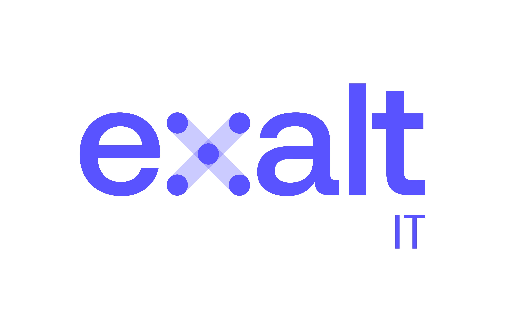

# Welcome to C++ FRUG!

<!-- _footer: "" -->

---

# #63!

---
## I am you host

For the 12th time
- Vivien MILLE
- Staff Engineer & Code cleaner at BNPP CIB

---
# Schedule

---
## Schedule

- 19h20 Lightning & small talks
  - Polymorphisme statique versus dynamique
  - C++ 2025 : le risque de l’immobilisme
  - Introduction aux concepts
  - Introduction aux modules
  - C++26's reflection: practical use-cases
- 20h20 Snacks & drinks
- 20h50 Joel FALCOU -- From Acrobatics to Ergonomics - A Field Report on How to Make Libraries Helpful

---
# C++FrUG

---
## C++FrUG

You can participate !

---
## C++FrUG

Propose a talk !

We can help to build your presentation and adapt the agenda

Remainder:
* Lightning talk
* Short talk (15-30 minutes)
* Full-fledged talk (50-60 minutes)

---

## C++FrUG

Host a C++ meetup !

You can:
* host the event (in your company, in a rented room)
* sponsor snacks & drinks

---
## C++FrUG

Join the Discord servers

[C++FrUG](https://discord.gg/YmKMABu9)

[Meetup](https://discord.gg/3K69BvqK)

---
## Conferences

- C++ Online: 11-15 March, Online
- using std::cpp: 16-18 March, Madrid, ES
- BeCPP: 30 March, Kortrijk, BE
- CppNow: 4-8 May, Aspen, US
- NDC Toronto (CppNorth): 5-8 May, Toronto, CA
- ACCU on Sea: 17-20 June, Folkstone, EN
- CppCon: 12-18 Sep, Aurora, US
- NDC Techdown: 21-24 Sep, Kongsberg, NO

---
## Sponsor

Thank you !

---
# Learn and share our knowledge of the C++ !
