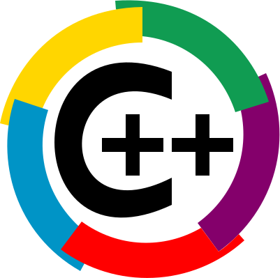
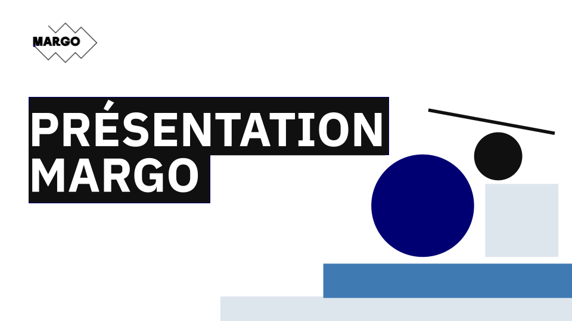
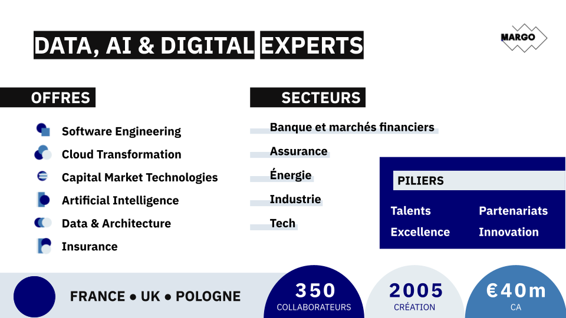
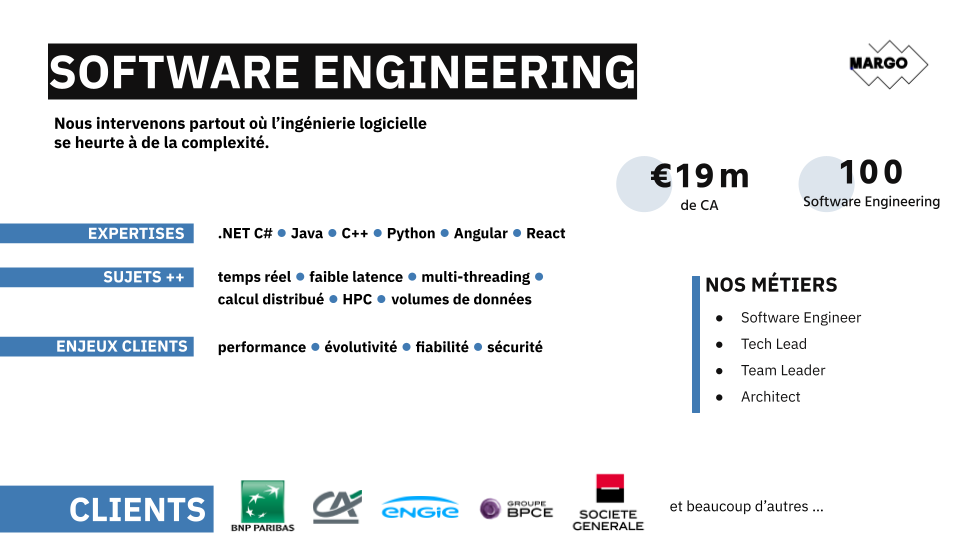

# Welcome to C++ FRUG!

<!-- _footer: "" -->

---

# #64!

---
## I am you host

For the 13th time
- Vivien MILLE
- Staff Engineer & Code cleaner at BNPP CIB

---
# Schedule

---
## Schedule

- 19h00 Welcome
- 19h15 News of the C++ ecosystem
- 19h20 Lightning talks
- 19h50 Snacks & drinks
- 20h20 Arnaud Becheler - Un algorithme de Louvain générique pour la Boost Graph Library
- 21h10 Thibault Ricord-Marchal - Modern Error Handling

---
# C++FrUG

---
## C++FrUG

You can participate !

---
## C++FrUG

Propose a talk !

We can help to build your presentation and adapt the agenda

Remainder:
* Lightning talk
* Short talk (15-30 minutes)
* Full-fledged talk (50-60 minutes)

---

## C++FrUG

Host a C++ meetup !

You can:
* host the event (in your company, in a rented room)
* sponsor snacks & drinks

---
## C++FrUG

Join the Discord servers

[C++FrUG](https://discord.gg/YmKMABu9)

[Meetup](https://discord.gg/3K69BvqK)

---
## News of the C++ ecosystem

* ISO in London
* LLVM 22
* gcc 16 in April ?
* MSVC 14.50

---
## Conferences

- BeCPP: 30 March, Kortrijk, BE
- CppNow: 4-8 May, Aspen, US
- NDC Toronto (CppNorth): 5-8 May, Toronto, CA
- ACCU on Sea: 17-20 June, Folkstone, EN
- CppCon: 12-18 Sep, Aurora, US
- NDC Techdown: 21-24 Sep, Kongsberg, NO

---
## Sponsor

Thank you !

---

---

---

---
# Learn and share our knowledge of the C++ !
